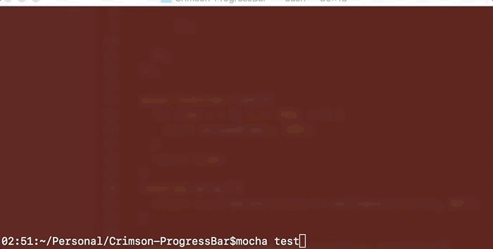

# Crimson-ProgressBar

A simple node stylish progress bar for the console

# Example



# Function Help

`renderProgressBar` takes two parameters:

 - currentValue
 - totalValue
 

# Code Example

to render one line simplys do the following:

```js
const crimsonProgressBar = require("crimson-progressbar");
crimsonProgressBar.renderProgressBar(50, 100)
```
